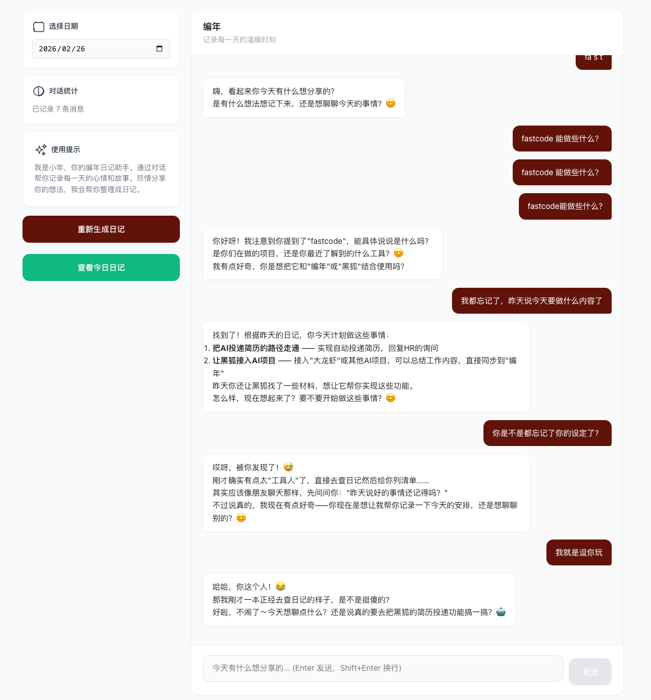
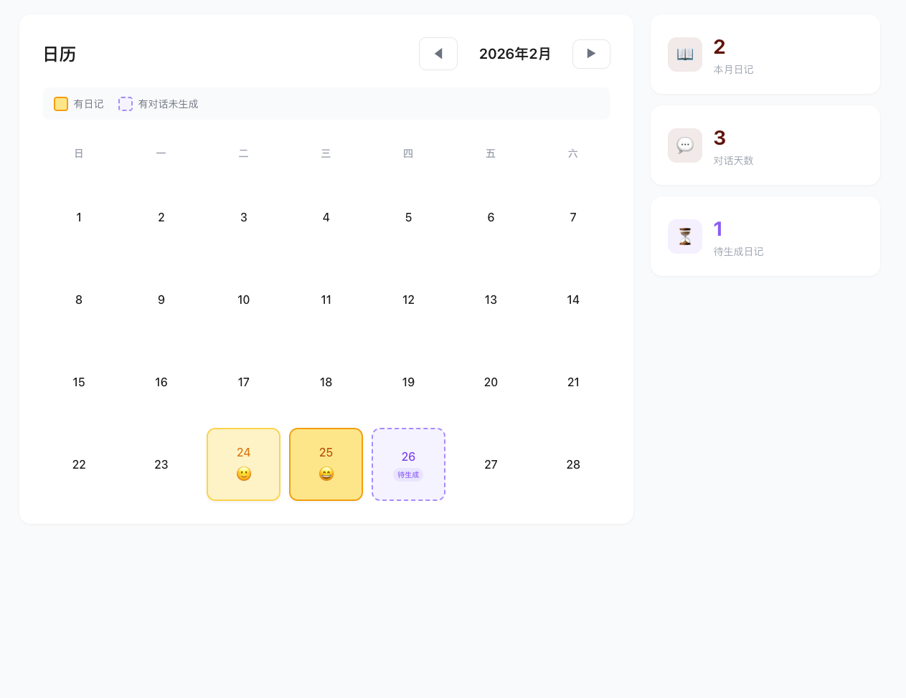
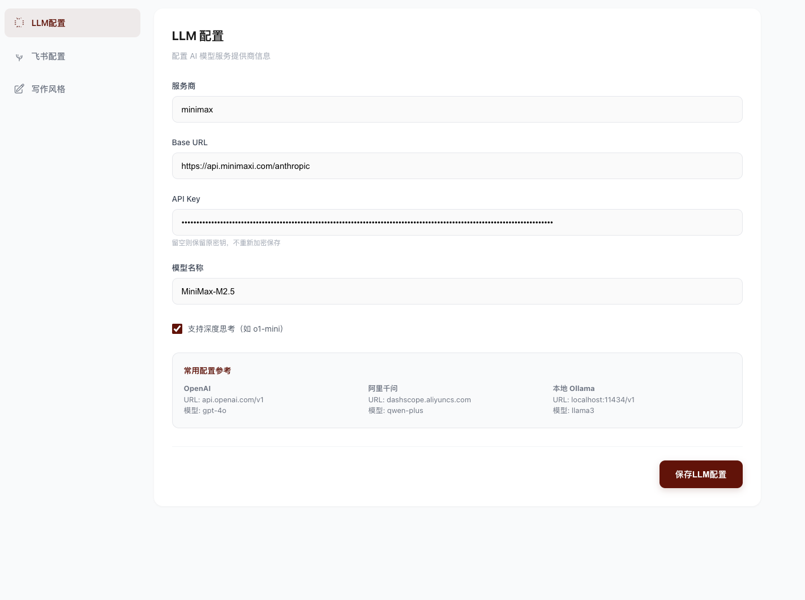
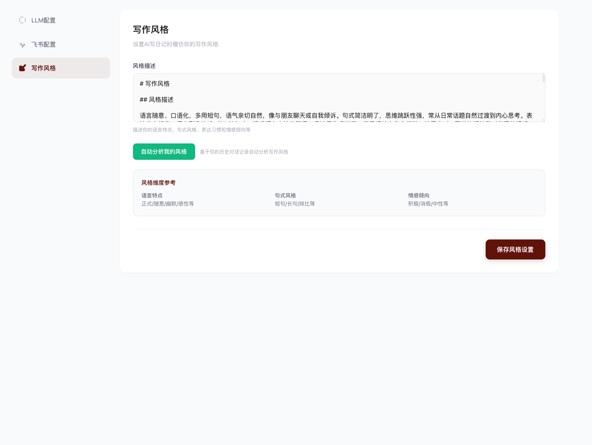

<!-- 项目名称 -->

<p align="right">
  <a href="https://github.com/nashobabrook/ai-diary/blob/main/README.md">English</a>
</p>

<p align="center">
  
</p>

<h1 align="center">编年 (BianNian)</h1>

<p align="center">
  <em>一个人就是一本<br/></em>
</p>

<p align="center">
  <a href="https://github.com/nashobabrook/ai-diary/releases">
    
  </a>
  <a href="https://github.com/nashobabrook/ai-diary/stargazers">
    
  </a>
  <a href="https://github.com/nashobabrook/ai-diary/blob/main/LICENSE">
    
  </a>
</p>

> AI 驱动的个人日记应用：通过对话记录生活，自动生成日记

---

## 特性

- **🤖 AI 对话式记录** - 像朋友聊天一样，自然记录每天的生活
- **📝 自动生成日记** - AI 将对话内容整理成精美的日记
- **🔍 智能检索** - 多维度相关性排序，快速找到历史记录
- **🎨 个性化写作风格** - AI 学习你的写作风格，生成专属日记
- **💾 本地存储** - 所有数据保存在本地文件系统，保护隐私
- **📊 心情分析** - 自动评估心情等级，了解情绪变化
- **🏷️ 智能标签** - 自动从对话中提取标签
- **📅 日历视图** - 可视化浏览历史日记和心情轨迹
- **✏️ 日记编辑** - 随时修改和优化 AI 生成的内容

---

## 截图

| 聊天页面 | 日历页面 |
|---------|---------|
|  |  |

| LLM 配置 | 写作风格 |
|----------|---------|
|  |  |

---

## 快速开始

### 前置要求

- Python 3.10+
- Node.js 18+
- [OpenAI](https://platform.openai.com/) 或 [MiniMax](https://platform.minimaxi.com/) API Key

### 安装

```bash
# 克隆项目
git clone https://github.com/nashobabrook/ai-diary.git
cd ai-diary

# 安装 Python 依赖
pip install -r requirements.txt

# 安装前端依赖
cd web
npm install
cd ..
```

### 启动

#### 方式一：一键启动（推荐）

```bash
# macOS / Linux
./start.sh

# Windows (Git Bash / WSL)
./start.sh
```

#### 方式二：手动启动

```bash
# 终端 1 - 启动后端 (端口 8080)
python3 src/llm.py

# 终端 2 - 启动前端
cd web
npm run dev
```

访问 http://localhost:5173 开始使用。

---

## 配置说明

### 1. LLM 配置

首次使用需要在设置页面配置你的 AI 提供商：

1. 点击导航栏「设置」
2. 填写配置信息：
   - **Provider**: 任意名称（如"OpenAI"、"千问"）
   - **Base URL**: API 端点地址（见下表）
   - **API Key**: 你的 API Key
   - **Model**: 模型名称（见下表）

### 2. 支持的 LLM 提供商

| 提供商 | Base URL | 示例模型 | Function Call |
|--------|----------|---------|---------------|
| **OpenAI** | `https://api.openai.com/v1` | `gpt-4o`, `gpt-4`, `gpt-3.5-turbo` | ✅ |
| **Azure OpenAI** | `https://{你的资源名}.openai.azure.com/` | `gpt-4`, `gpt-35-turbo` | ✅ |
| **MiniMax** | `https://api.minimaxi.com/v1` | `abab6.5s-chat`, `abab6.5g-chat` | ✅ (Anthropic 格式) |
| **通义千问** | `https://dashscope.aliyuncs.com/compatible-mode/v1` | `qwen-max`, `qwen-plus` | ✅ |
| **智谱清言** | `https://open.bigmodel.cn/api/paas/v4` | `glm-4`, `glm-3-turbo` | ✅ |
| **Ollama (本地)** | `http://localhost:11434/v1` | `llama3`, `qwen2`, `mistral` | ⚠️ 取决于模型 |
| **LM Studio (本地)** | `http://localhost:1234/v1` | 任意已加载模型 | ⚠️ 取决于模型 |

> **注意**：Function Call 需要模型支持。云端模型（OpenAI、MiniMax、千问、智谱）基本都支持。本地模型（Ollama、LM Studio）取决于具体模型。

### 3. 写作风格（可选）

个性化你的日记风格：

1. 进入设置页面
2. 点击「分析写作风格」让 AI 学习你现有的日记
3. 或手动编辑数据目录下的 `writing_style.md`

---

## 技术栈

### 后端

| 技术 | 用途 |
|------|------|
| FastAPI | Web 框架 |
| OpenAI SDK | LLM 接口 |
| Pydantic | 数据验证 |

### 前端

| 技术 | 用途 |
|------|------|
| React 18 | UI 框架 |
| Vite | 构建工具 |
| React Router | 路由 |
| Day.js | 日期处理 |

---

## 项目结构

```
ai-diary/
├── src/                    # 后端代码
│   ├── llm.py             # FastAPI 入口
│   ├── agent.py           # 核心 Agent 逻辑
│   ├── function_tools.py  # Function Call 工具
│   ├── retrieval/         # 检索模块
│   ├── user_profile.py    # 用户画像管理
│   └── writing_style.py   # 写作风格管理
│
├── web/                   # 前端代码
│   ├── src/
│   │   ├── pages/        # 页面组件
│   │   │   ├── ChatPage.jsx
│   │   │   ├── CalendarPage.jsx
│   │   │   ├── StatsPage.jsx
│   │   │   └── ConfigPage.jsx
│   │   └── components/   # 可复用组件
│   └── ...
│
├── bianNian/              # AI 人格配置
│   ├── diary-soul.md     # 小年人格设定
│   └── dialogue.md       # 对话策略
│
├── data/                  # 数据存储（自动创建）
│   ├── diaries/           # 日记文件
│   ├── conversations/    # 对话记录
│   └── index/             # 检索索引
│
├── config/                # 用户配置（自动创建）
├── start.sh               # 一键启动脚本
└── README.md              # 说明文档
```

---

## 数据存储

所有数据存储在本地的 `data/` 目录：

| 目录 | 说明 |
|------|------|
| `data/default/diaries/` | 生成的日记文件 |
| `data/default/conversations/` | 对话历史 |
| `data/default/index/` | 检索索引 |
| `data/default/user.md` | 用户画像 |
| `data/default/writing_style.md` | 自定义写作风格 |

---

## API 文档

### 核心接口

| 接口 | 方法 | 说明 |
|------|------|------|
| `/chat` | POST | 发送聊天消息 |
| `/diary/{date}` | GET | 获取指定日期日记 |
| `/diary/{date}` | PUT | 更新日记内容 |
| `/diary/generate` | POST | 生成日记 |
| `/calendar/{year}/{month}` | GET | 获取日历数据 |
| `/stats` | GET | 获取心情统计数据 |
| `/config/{user_id}` | GET | 获取用户配置 |
| `/user/style/{user_id}` | GET/POST | 获取/设置写作风格 |

---

## 常见问题

### Q: 数据安全吗？

A: 是的！所有数据都保存在本地机器上，不上传云端，完全隐私。

### Q: 支持哪些 LLM 提供商？

A: 目前支持 OpenAI 和 MiniMax。架构支持任何兼容 OpenAI API 的服务。

### Q: 写作风格如何工作？

A: 你可以让 AI 分析你现有的日记来学习你的风格，也可以在 `writing_style.md` 中手动编写你的风格偏好。

### Q: 可以编辑 AI 生成的日记吗？

A: 可以！点击任意日记的「编辑」按钮，可以修改内容、心情和标签。

### Q: 如何备份？

A: 只需备份整个 `data/` 目录即可。

### Q: 支持 Windows 吗？

A: 支持！请使用 [Git Bash](https://git-scm.com/download/win) 或 [WSL](https://docs.microsoft.com/zh-cn/windows/wsl/) 来运行启动脚本。

---

## 许可证

MIT License - 查看 [LICENSE](./LICENSE) 了解详情。

---

<p align="center">
  由 <a href="https://github.com/nashobabrook">nashobabrook</a> 用 ❤️ 构建
</p>
